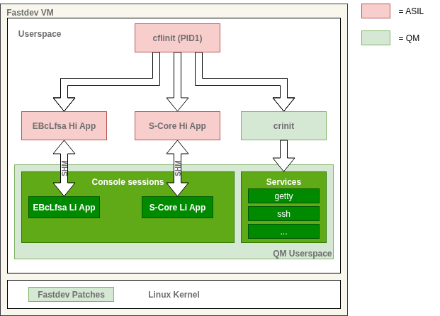

# Eclipse S-CORE on Elektrobit corbos Linux for Safety Applications

This directory shows the integration of Eclipse S-CORE on Elektrobit corbos Linux for Safety Applications.
It builds an [example based on the Eclipse S-CORE communication framework](https://github.com/eclipse-score/scrample) as demo/test application.
This application is then [integrated](scrample_integration/) into the so-called "fast-dev" variant of EB corbos Linux for Safety Applications (EBcLfSA).
This is an `aarch64`-based, pre-built image, capable of demonstraing the execution of high integrity applications in regular Linux user-space.
The example can be executed using QEMU.
In the [related CI workflow](../.github/workflows/build_and_test_ebclfsa.yml), all these steps are performed, and the resulting log files are stored and made available for download.

> [!TIP]
> **Quick Start**
>
> The steps performed in continuous integration can be also run interactively.
> The fastest way to achieve this is to use [GitHub Codespaces](https://github.com/features/codespaces), a cloud based development environment.
> You need a GitHub.com account for this to work.
There is a free tier of this commercial service, which is sufficient.
However, please understand that we cannot advise you about possible costs in your specific case.
> - Click on the following badge: [](https://codespaces.new/eclipse-score/reference_integration)
> - In the following dialog, make sure to select "Machine type" as "4-core".
> Click "Create codespace."
> It will take some time (2-3 minutes) for the machine to start.
> There will be a log message "Finished configuring codespace."
> - Hit "Ctrl-Shift-C" to open a new terminal.
> - Copy and paste the following command into the terminal and hit "Enter":
>
> ```bash
> cd ./ebclfsa && bazel build --config=aarch64-ebclfsa //scrample_integration:run
> ```
>
> This will build and run the example.
> There may be a warning about "High codespace CPU (100%) utilization detected.", which you can ignore.
> The complete process will take around 6 minutes to complete on the 4-core machine.
>
> The expected output looks like this:
>
> ```console
> [...]
> Target //scrample_integration:run up-to-date:
>  bazel-bin/scrample_integration/qemu_run.log
>  bazel-bin/scrample_integration/ssh_scrample_run.log
>INFO: Elapsed time: 361.273s, Critical Path: 91.92s
>INFO: 836 processes: 10 internal, 826 local.
>INFO: Build completed successfully, 836 total actions
> ```
>
> The two log files mentioned in this output are the main results of the test execution.
> You can open them by Ctrl-clicking on the output entry.
>
> The remainder of this document describes in detail what you have just accomplished.
>
> In order to close the Codespace again, first take note of the name of the Codespace.
> It is a random combination of and adjective and a noun, mentioned in the bottom left of the browser window.
> Go to your [GitHub Codespaces Dashboard](https://github.com/codespaces), find the Codespace in your list, click on the "..." in that row and select "Delete".
>
> Note that the demo can, of course, als run locally on your computer.
> Clone the repository, open it in Visual Studio Code, start the supplied Development Container, and run the demo as described above.
> This requires a setup that can run [Development Containers](https://containers.dev/) using [Visual Studio Code](https://code.visualstudio.com/).
> The [Visual Studio Code documentation](https://code.visualstudio.com/docs/devcontainers/containers) can be a good starting point; however, an in-depth explanation of this is beyond the goals of this Quick Start.

## Prebuilt Binary Assets

The whole setup is open source.
To simplify the deployment and focus on the integration itself, this demo uses pre-built binary assets.
These consist of a pre-built image and a cross-compilation toolchain.
Both assets are referenced in the corresponding Bazel targets and are automatically downloaded on demand.

The pre-built image provides a so called "fast-dev" integration for EBcLfSA,
which makes development and debugging of high integrity applications easy.
The fast-dev image itself is based on a single aarch64 Linux VM with a specially patched Linux kernel and user-space.
It checks at runtime, whether high integrity applications adhere to certain assumptions of use (AoU) of EBcLfSA.

Note that this image represents a development image but not a production image of Linux for Safety Application.
It is aimed at demonstrating development with focus on key features and AoUs.

## Main constraints for high-integrity applications

For non-safety ("low integrity") applications, Linux for Safety Applications _is_ a standard Linux system.
For applications with safety requirements, also referred to as _high integrity (HI) applications_,
Linux for Safety Applications expects few constraints, especially:

1. An HI application must be flagged with an additional checksum in its ELF-header to be detected as an high integrity application.
2. An HI application must check its registration status with the supervisor.
3. At least one HI application (e.g. a health manager) must cyclically trigger
   the watchdog of Linux for Safety Applications.
4. Few kernel system calls are not allowed to be invoked by an HI application.
   - The patches of the "fast-dev" kernel will create a log which helps you to identify them.
   - Recommendation:
     Build your HI applications and associated libraries on top of the C standard's library definition.
  Elektrobit will provide an appropriately qualified version for production projects.
5. Ask for advice when you want to modify/extend kernel functionality or invoke device-specific I/O operations.

The example application disregards the items 2-5.
They are mandatory for production systems but can be violated during development in the fast-dev environment.
For example, the items 3 and 4 only make sense in a complete system.

Current restrictions:

- HI applications must be statically linked.
- PID1 needs to be an HI process.
- HI processes can only be started by another HI process.

## Application- and Integration-Specific Violation of System Call Restrictions

The current integration setup is based on a non-safety-certified set of a toolchain and standard libraries.
As a result, an application compiled and linked with the provided example toolchain will generate system call violations.
For the used communication example app this happens during application startup/teardown and is indicated by the occurrence of `ioctl`,`clone3` and `madvice` system calls.

The full product version intended for production implements process and memory management for high integrity applications according to the C Standard Library.
When using other standard library implementations, `clone3` and `madvice` might be called.
This is ok during development and will not affect you when switching to the safety compliant C Standard Library.
Avoid calling such system calls directly from HI applications, though.
The following table gives an overview why the occurred system calls are not supported and what would be the proposed alternative solution.
Keep in mind, this is only relevant if the system calls are explicitly called by the application code, or libraries other than the provided standard libraries.

| System Call | Reason | Suggested Alternative or Workaround |
|---------|--------|-------------------------------------|
| `ioctl` | Very flexible function signature, which is hard to "make safe" in a generic way. | Try to avoid direct `ioctl` calls. If direct driver interaction is needed, use alternative kernel standard interfaces like `netlink` or device file IO. A customer specific implementation of a certain function signature might be possible. |
| `clone3` | No part of C standard library. Not needed to create HI processes. | Use C standard library functions to create processes and threads (or system call `clone`). The full product version intended for production will implement them in a way that ensures safe execution. |
| `madvise` | No part of C standard library. All memory of HI Apps is pre-faulted and fully committed at allocation time, hence most kernel optimizations/hints have limited effect. | Use C standard library functions for memory management. The full product version intended for production will implement them in a way that ensures safe execution. |

## User-Space

The user-space of the pre-built image consists of three main components:

- The _trampoline application_, a simplified HI init process
- EBcLfSA example HI and LI applications
- Low integrity system init and user-space



The system itself is able to run without any Eclipse S-CORE demo applications.
Nevertheless, the trampoline application already provides an entry point for a subsequently deployed application binary.
This entry point is used by the [Eclipse S-CORE Example](#eclipse-s-core-example) application.

### Trampoline App (cflinit)

The trampoline application `cflinit` acts as a simplified HI init process which starts the applications as listed above.
This includes the HI application of the EBcLfSA example, as well as a wrapper for the Eclipse S-CORE application binary.
Besides the HI applications, it starts [crinit](https://gitext.elektrobitautomotive.com/EB-Linux/crinit) as a secondary low integrity init daemon,
which brings up the regular (low integrity) Linux user-land.
Once all apps are started, it sleeps forever.

Below you can see the output generated by `cflinit`.

```console
cflinit: INFO: Hello from EBcLfSA HI init application
cflinit: INFO: Mounted tmpfs to /dev/shm
cflinit: INFO: Starting application crinit
cflinit: INFO: Starting application HI App
cflinit: ERROR: Could not read /usr/bin/hi_app (2)
cflinit: INFO: Starting application EBcLfSA HI demo
cflinit: INFO: Starting application EBcLfSA HI upper
cflinit: INFO: Finished starting child applications; going to sleep
```

As long as the Eclipse S-CORE example is not yet deployed (detected by a missing `/usr/bin/hi_app` binary) the above `ERROR` occurs and `cflinit` skips starting it.

### EBcLfSA HI Demo

For technical reasons, the image contains also a secondary demo, with the executables `ebclfsa-hi-demo`,   `ebclfsa-hi-upper`,  and `ebclfsa-li-demo`.
They demonstrate message passing via a shared memory interface, which does not use Eclipse S-CORE.
Hence, they are not relevant for the demonstration and should be ignored.

### Low Integrity System Init and User-Space

As mentioned above, `crinit` is used to set up a low integrity user-land beside the high integrity applications.
This is used primarily for development and user experience by providing components like an SSH server, a login daemon, or `gdbserver`.

## Eclipse S-CORE Example

> [!IMPORTANT]
> This guide assumes that you use the SDK's [dev-container](https://github.com/eclipse-score/devcontainer).
> If you are using the Codespace as described in the Quick Start, this is the case.
> The dev-container contains all required dependencies, like `qemu-system-aarch64` and `sshpass`.

This section shows how you can use the above described SDK with the example application.
You will see how you can create a low integrity and a high integrity application, build them with the S-CORE toolchain and run them finally on Linux for Safety Applications.

The first three subsections explain the build and runtime setup.
They help you to understand the integration.
You can apply the approach on other S-CORE apps, too.

- Application Setup:
  The two application setup of the example and how to make one of them an HI application.
- S-CORE Toolchain in Linux for Safety Applications:
  The general integration of the required tools into S-CORE's Bazel toolchain.
  This should work for other applications, too.
- Bazel Rules for the Example Applications: The specific Bazel ruleset for the example

The next three sections guide you through the concrete steps of applying these rules
to build and deploy the example.

- Full Run of the Example Application
- Building the application
- Using the fast-dev image

And please also look at the shortcuts we implemented in the Visual Studio Code workspace to speed up the usage of the application example.
You find them at the end of this section.

### Application Setup

The application setup is constructed of two instances of the `scrample` application, a high integrity (HI) instance acting as receiver and a low integrity (LI) instance acting as sender.
The HI instance is started automatically by `cflinit` and listens in background.
You start the LI instance manually in a terminal to run the demo.
Even though both instances rely on the same source code, they do not use the same application binary.
The HI application instance uses a binary located at `/usr/bin/scrample_sil` with a marked ELF-header, while the unmodified binary for the LI application is located at `/usr/bin/scrample`.

The application instances are called with the following arguments:

| HI     | LI |
| -------- | ------- |
| `-n 10 -m recv -t 200 -s /etc/mw_com_config.json`  | `-n 10 -m send -t 200 -s /etc/mw_com_config.json`    |

Feel free to adjust them as needed.

In order to have those arguments changeable, the HI arguments are not hardcoded into `cflinit`.
Instead, `cflinit` calls a small wrapper binary `/usr/bin/hi_app` which is based on the implementation in `scrample_integration/src/main.cc`.
When `hi_app` is executed by `cflinit`, it simply calls `execve` on `/usr/bin/scrample_sil` with the correct set of arguments.
This way `cflinit` keeps its static entrypoint for the Eclipse S-CORE example app, while the user is still able to specify the used arguments for the HI `scrample` instance.

### S-CORE Toolchain in Linux for Safety Applications

The demo SDK integrates the [S-CORE toolchain with two extensions](https://github.com/elektrobit-contrib/eclipse-score_toolchains_gcc/releases/tag/0.5.0-alpha):

- Additional tooling for AArch64 cross-building.
- Additional tool `lisa-elf-enabler`: It marks an ELF header of an application in a way that Linux for Safety Applications detects it as an HI application.
  The tool is available to Bazel via `@gcc_toolchain_gcc//:elf-enabler`.

### Bazel Rules for the Example Applications

The example extends the [`scrample` example](https://github.com/eclipse-score/scrample) of S-CORE with the application setup and the toolchain extensions described above.
With those changes, the toolchain can be used via `bazel build  --config=aarch64-ebclfsa //scrample_integration:<target>`.

> [!IMPORTANT]
> Building inside a sandbox is currently not possible.

For building and running the example setup, the following Bazel rules have been created in `scrample_integration/BUILD`:

| Target | Dependencies | Description |
| ------ | ------------ | ----------- |
| `scrample_sil` | `@score_scrample//src:scrample` | Create copy of `scrample` at `scrample_sil` and add CRC checksum to ELF-header |
| `scrample_sil_wrapper` | | Build intermediate `scrample_sil_wrapper` |
| `hi_app` | `:scrample_sil_wrapper` `:scrample_sil` | Create copy of `scrample_sil_wrapper` at `hi_app` and add CRC checksum to ELF-header. |
| `fetch-fastdev-archive` | | Download fast-dev image archive |
| `fastdev-image` | `:fetch-fastdev-archive` | Extract fast-dev image archive |
| `upload` | `:hi_app` `:fastdev-image` | Upload application binaries to fast-dev image |
| `run` | `:upload`| Run Eclipse S-CORE example application |

The following sections introduce some of the rules mentioned above.

### Full Run of the Example Application

The `run` target provides an easy entry point, to build, post-process, deploy, run and stop the example:

```bash
bazel build --config=aarch64-ebclfsa //scrample_integration:run
```

This command will take a while to finish, since it performs some downloads and starts the fast-dev image.
After successful execution LI application instance can be seen in the `ssh_run.log`:

```console
Starting to send data
Sending sample: 0
Sending sample: 1
Sending sample: 2
Sending sample: 3
Sending sample: 4
Sending sample: 5
Sending sample: 6
Sending sample: 7
Sending sample: 8
Sending sample: 9
Stop offering service...and terminating, bye bye
```

`qemu_run.log` provides the serial console output of the started fast-dev image, including the following noteworthy parts:

1. `cflinit` starting `hi_app` as HI application:

```console
cflinit: INFO: Starting application HI App
```

2. `hi_app` starting `scrample_sil` as HI application:

```console
HI_App: Starting scrample_sil
```

3. The logs from `scrample_sil` as receiver itself

```console
1970/01/01 00:00:01.1905 19125 000 ECU1 IPBR lola log info verbose 2 No explicit applicationID configured. Falling back to using process UID.  Ensure unique UIDs for applications using mw::com. 
...
1970/01/01 00:00:10.10215 102158 000 ECU1 IPBR lola log info verbose 2 Successfully created offer path /tmp/mw_com_lola/service_discovery/6432/1 
score/MapApiLanesStamped: Subscribing to service
score/MapApiLanesStamped: Received sample: 0
score/MapApiLanesStamped: Received sample: 1
score/MapApiLanesStamped: Proxy received valid data
score/MapApiLanesStamped: Cycle duration 225ms
score/MapApiLanesStamped: Received sample: 2
score/MapApiLanesStamped: Proxy received valid data
score/MapApiLanesStamped: Cycle duration 206ms
...
score/MapApiLanesStamped: Received sample: 9
score/MapApiLanesStamped: Proxy received valid data
score/MapApiLanesStamped: Cycle duration 202ms
score/MapApiLanesStamped: Unsubscribing...
score/MapApiLanesStamped: and terminating, bye bye
```

4. Kernel logs indicating that some performed system calls would not be allowed on a production system.
For more information on this, check the [previous section](#application--and-integration-specific-violation-of-system-call-restrictions) on application- and integration-specific syscall violations.

```console
SDK:handler_do_el0_svc_pre: syscall __NR_clone3 (435) is not allowed
```

### Building the Application

Building all components of the example application can be performed with the `hi_app` rule.

```bash
bazel build --config=aarch64-ebclfsa //scrample_integration:hi_app
```

Due the dependencies towards `:scrample_sil` and `:scrample_sil_wrapper` this will build all required binaries.
Including the LI `scrample` binary, a temporary `scrample_sil_wrapper` binary as well as the post-processed `scrample_sil` and `hi_app` binaries.

### Using the fast-dev Image

The easiest way to setup the fast-dev image, is to use the `fastdev-image` rule.

```bash
bazel build --config=aarch64-ebclfsa //scrample_integration:fastdev-image
```

This will first download the image via the `fetch-fastdev-archive` rule and cache the archive.
Afterwards, the `fastdev-image` rule extracts the archive (containing a disk image and a kernel) to `bazel-bin/scrample_integration/deb-qemuarm64/`.

To start the unmodified base image (without the Eclipse S-CORE example application) manually, the included `run_qemu.sh` script can be used.

```bash
./scrample_integration/run_qemu.sh bazel-bin/scrample_integration/deb-qemuarm64/
```

This is of course optional, and only needed if a deeper manual look into the image is wished.
After the image has started up, the password `linux` can be used for the `root` user for login.
The ssh port of the qemu instance is forwarded to `localhost:2222`.
Therefore `ssh` and `scp` can be used with the same credentials from inside the development container.

```bash
ssh -p 2222 root@localhost
```

> [!NOTE]
> Be aware, that running the image via qemu, will change the stored disk image.
> Bazel will detect this change and overwrite the disk image with the original one from the downloaded archive.
> If it is planned to have persistent changes on the image, copy the content of `bazel-bin/scrample_integration/deb-qemuarm64/` to a location outside of `bazel-bin` and adapt the command line argument in the above `run_qemu.sh` call accordingly.

For deploying the example application to the image, the `upload` rule is available, which will start the image based on the content of `bazel-bin/scrample_integration/deb-qemuarm64/` and deploy all needed files via `scp`.

```bash
bazel build --config=aarch64-ebclfsa //scrample_integration:upload
```

Since the deployment step will change the stored disk image, the `upload` rule stores its output in `bazel-bin/scrample_integration/deb-qemuarm64-modified/`.
Running the image with the deployed example applications works the same way as before, just with a different folder for the used image and kernel:

```bash
./scrample_integration/run_qemu.sh bazel-bin/scrample_integration/deb-qemuarm64-modified/
```

Like before you can interact with the image via the serial console or ssh.
To trigger the LI Eclipse S-CORE example app, simply call:

```bash
scrample -n 10 -m send -t 200 -s /etc/mw_com_config.json
```

Note that due to the nature of the `scrample_sil` application, which shuts down after having received the defined amount of samples, this command works only once per boot-cycle.

To reboot or power-off the running image, `crinit-ctl` with the command line argument `reboot` or `poweroff` can be used.

```bash
# Reboot
crinit-ctl reboot
# Poweroff
crinit-ctl poweroff
```

## Further notes

* The toolchain and librares are provided for demonstration and prototyping purposes without further qualification.
* A second test case for S-CORE persistency is also integrated. You can run it via
  `bazel build --config=aarch64-ebclfsa //persistency_integration:run`
  However, this is not integrated as HI application to avoid the additional complexity of the required wrapper.
